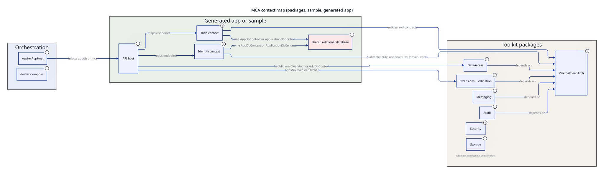

# 01. System overview

Start here if you are new. This repo ships NuGet packages, a `dotnet new mca` template, a sample API, and an Aspire orchestrator. There is no separate production product with its own hosts beyond those.

## What the product does

MinimalCleanArch (MCA) is a Clean Architecture toolkit for Minimal APIs on .NET 9 and .NET 10. It gives you:

- Domain primitives: entities, `Result`/`Error`, specifications, `IRepository`, `IUnitOfWork`, domain events
- EF Core repositories and audited/soft delete `DbContext` bases
- Minimal API bootstrap, ProblemDetails, validation, rate limiting
- Optional Wolverine messaging, audit logs, column encryption, blob storage
- A template that scaffolds a Todo + optional Identity/OpenIddict app using those packages

The sample at `samples/MinimalCleanArch.Sample` is the demonstration of the same stack inside this repository. It is a Todo API plus ASP.NET Identity users, not a multi tenant business system.

## Deployed hosts

Nothing in this repo is a cloud service you deploy as MCA itself. These are the runnable hosts.

| Host | Path | Role | Default data stores |
|---|---|---|---|
| Sample API | `samples/MinimalCleanArch.Sample` | Direct `dotnet run` demo | SQLite `todos.db` / `minimalcleanarch.db` fallback, in-memory cache, in-memory Wolverine |
| Aspire AppHost | `samples/MinimalCleanArch.Aspire/MinimalCleanArch.AppHost` | Local orchestration for the sample | Postgres connection name `mca`, Redis connection name `redis` |
| Generated API (multi) | `src/{Name}.Api` after `dotnet new mca` | Consumer HTTP host | SQLite, SQL Server, or Postgres via `--db` |
| Generated API (single) | project root after `--single-project` | Same host, one project | Same |
| Generated AppHost | `{Name}.AppHost` when `--aspire` | Orchestrates generated API | Connection name `appdb`, optional `redis` |

Sample listen URLs from `samples/MinimalCleanArch.Sample/Properties/launchSettings.json`:

- `https://localhost:5095`
- `http://localhost:5096`

Scalar is `/scalar/v1` in Development.

Aspire sample wiring is `samples/MinimalCleanArch.Aspire/MinimalCleanArch.AppHost/Program.cs`. It starts Postgres, Redis, and the sample project named `api`.

Generated compose/kind scripts exist only when `--docker` or `--all` is used and `--aspire` is not. They are template output, not a live path in this repo.

## Solution layout

`MinimalCleanArch.slnx` groups four folders.

| Folder | Projects | Purpose |
|---|---|---|
| `src/` | Eight MCA packages | Published libraries |
| `samples/` | Sample API, AppHost, ServiceDefaults | Runnable reference |
| `tests/` | Unit, integration, template, benchmarks | Package and template tests |
| `docs/` | `MinimalCleanArch.Docs` | Leftover DocFX stub, not this markdown set |

Template sources are not a solution project. They live in `templates/mca/` and are packed as `MinimalCleanArch.Templates`.

```text
src/
  MinimalCleanArch/                 core primitives
  MinimalCleanArch.DataAccess/      EF repositories
  MinimalCleanArch.Extensions/      HTTP host helpers
  MinimalCleanArch.Validation/      FluentValidation registration
  MinimalCleanArch.Messaging/       Wolverine + domain events
  MinimalCleanArch.Audit/           change history
  MinimalCleanArch.Security/        column encryption
  MinimalCleanArch.Storage/         Azure Blob / R2
samples/
  MinimalCleanArch.Sample/          one project demo API
  MinimalCleanArch.Aspire/          AppHost + ServiceDefaults
templates/mca/
  multi/                            Domain, Application, Infrastructure, Api
  single/                           same folders in one project
  aspire/                           AppHost + ServiceDefaults
tests/
```

## Context map

Treat packages as capability modules. Treat Todo and Identity as the only consumer domains. They share one relational database in both the sample and the generated app.



| Name | Kind of boundary | Database | Honest DDD status |
|---|---|---|---|
| Toolkit core | NuGet package `MinimalCleanArch` | none | Shared kernel of primitives. Not a business context. |
| Persistence | NuGet `MinimalCleanArch.DataAccess` | consumer DbContext | Infrastructure. Generic `Repository<TEntity,TKey>`. |
| HTTP host | NuGet `Extensions` + `Validation` | none | Presentation. |
| Messaging | NuGet `MinimalCleanArch.Messaging` | optional `wolverine` schema | Infrastructure. Outbox only with SQL Server or Postgres. |
| Audit | NuGet `MinimalCleanArch.Audit` | `AuditLog` in the same DbContext | Infrastructure table, not its own store. |
| Security | NuGet `MinimalCleanArch.Security` | encrypted columns in the same DB | Infrastructure. |
| Storage | NuGet `MinimalCleanArch.Storage` | Azure Blob or R2 | Separate object store. No domain model. |
| Todo | Sample + generated Domain | `Todos` table | Closest thing to an aggregate. Single entity, no children. |
| Identity | Sample `User` / template `ApplicationUser` | Identity + OpenIddict tables | Framework owned. Anemic. Same DbContext as Todo. |

There is no context isolation at the database. `ApplicationDbContext` (sample) and `AppDbContext` (template) map Todos, Identity, optional `AuditLog`, and optional OpenIddict together.

## How the two consumer shapes differ

The sample and the template are both “an MCA app”, but they are not the same design.

| Concern | Sample | Generated template |
|---|---|---|
| Project shape | One project, folders `API/`, `Domain/`, `Infrastructure/` | Multi project or `--single-project` with `Domain/Application/Infrastructure` |
| Todo write path | `TodoEndpoints` uses `IRepository<Todo>` directly | `TodoCommandHandler` via handler or `IMessageBus` |
| User model | `User : IdentityUser` in Domain | `ApplicationUser` in `Application/Identity` (Identity stays out of Domain) |
| Auth stack | `AddIdentityApiEndpoints<User>` plus custom `/api/users` | Optional `--auth`: Identity + OpenIddict + `/api/auth` |
| Domain event interceptor | Registered in DI, **not** added to DbContext | `options.UseDomainEventPublishing(sp)` when `--messaging` |
| Durable outbox | Not used (in-memory even under Aspire) | `AddMinimalCleanArchMessagingWithSqlServer/Postgres` when `--messaging` and `--db` is not sqlite |

## Package dependency direction

From project references and package READMEs:

| Package | Depends on MCA | Typical layer |
|---|---|---|
| `MinimalCleanArch` | none | Domain |
| `MinimalCleanArch.DataAccess` | core | Infrastructure |
| `MinimalCleanArch.Extensions` | core | API/Host |
| `MinimalCleanArch.Validation` | core + Extensions | API/Host |
| `MinimalCleanArch.Messaging` | core | Infrastructure or host |
| `MinimalCleanArch.Audit` | core | Infrastructure |
| `MinimalCleanArch.Security` | none | Infrastructure |
| `MinimalCleanArch.Storage` | none | Infrastructure |

Generated architecture tests in `templates/mca/tests/MCA.UnitTests/Architecture/ArchitectureTests.cs` enforce: Domain does not reference Infrastructure, Endpoints, ASP.NET Identity, Storage, or Wolverine. Application does not reference Infrastructure or Wolverine.

## Next

- Request path and layers: [02. Architecture](02-architecture.md)
- Todo and Identity details: [contexts/todo.md](contexts/todo.md), [contexts/identity.md](contexts/identity.md)
