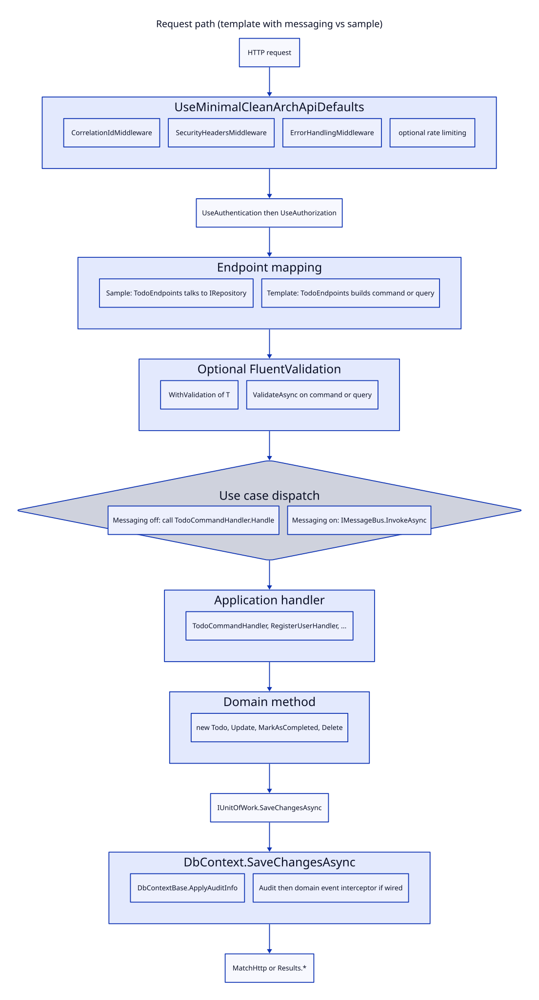

# 02. Architecture

Start with the request path, then the layer rules, then composition and persistence. Two live paths exist: the sample API and a generated `mca` app.

## Request path

### Sample (`samples/MinimalCleanArch.Sample/Program.cs`)

1. `AddServiceDefaults()` (Aspire ServiceDefaults, always referenced).
2. `AddSerilogLogging()`, optional `AddMinimalCleanArchTelemetry` when Aspire OTLP is absent.
3. `AddMinimalCleanArchApi(...)` registers ProblemDetails, `HttpExecutionContext`, validators, rate limiting.
4. `AddMinimalCleanArch<ApplicationDbContext>` registers `IRepository<,>`, `IUnitOfWork`, and the DbContext. Audit interceptor is attached when `Features:AuditLogging` is true (default true).
5. Identity, cache, optional `AddMinimalCleanArchMessaging` (in memory).
6. Pipeline: `UseMinimalCleanArchApiDefaults` (correlation, security headers, `ErrorHandlingMiddleware`, rate limiting), Serilog request logging, HTTPS, auth.
7. Endpoints: `MapIdentityApi<User>()`, `MapTodoEndpoints()`, `MapUserEndpoints()`, health checks.

A Todo POST does **not** go through an application handler. `TodoEndpoints.CreateTodo` constructs `Todo`, calls `IRepository<Todo>.AddAsync`, then `IUnitOfWork.SaveChangesAsync`. See `samples/MinimalCleanArch.Sample/API/Endpoints/TodoEndpoints.cs`.

### Generated template (`templates/mca/single/Program.cs` and `templates/mca/multi/MCA.Api/Program.cs`)

1. Optional `AddServiceDefaults()` when `--aspire`.
2. `AddDbContext<AppDbContext>` with provider, optional `UseAuditInterceptor`, optional `UseDomainEventPublishing`.
3. `ITodoRepository` + `IUnitOfWork` registered explicitly (not always via `AddMinimalCleanArch`).
4. `TodoCommandHandler` as scoped. Auth handlers registered when `--auth`.
5. `AddMinimalCleanArchApi` when polish features are on.
6. Same middleware defaults when `UseMcaApiBootstrap`.
7. Endpoints call either `TodoCommandHandler.Handle` or `IMessageBus.InvokeAsync<Result<...>>` when `--messaging`.

## Layers

MCA is Clean Architecture for **dependency direction**, plus vertical slice / CQRS style handlers in generated apps.

| Layer | Sample location | Template location | Allowed to know |
|---|---|---|---|
| Domain | `samples/.../Domain/` | `templates/mca/*/Domain/` or `MCA.Domain` | MCA core only |
| Application | `samples/.../Application/Handlers/` (events only) | `templates/mca/*/Application/` | Domain, Identity stores when `--auth` |
| Infrastructure | `samples/.../Infrastructure/` | `templates/mca/*/Infrastructure/` | Domain, Application, EF, encryption, email |
| Host | `Program.cs`, `API/` | `MCA.Api` or `Endpoints/` + `Program.cs` | Everything |

The sample Application folder has event handlers only. Todo use cases live in the endpoint class. That is DDD inspired, not a use case layer.

## Composition (DI)

### Sample (`Program.cs`)

| Registration | Type |
|---|---|
| `AddMinimalCleanArchApi` | `IExecutionContext` → `HttpExecutionContext`, validators, rate limiting |
| `AddEncryption` | `IEncryptionService` |
| `AddAuditLogging` + `AddAuditLogService<ApplicationDbContext>` | `AuditSaveChangesInterceptor`, `IAuditLogService` |
| `AddMinimalCleanArch<ApplicationDbContext>` | `DbContext`, `IUnitOfWork` → `UnitOfWork`, `IRepository<,>` → `Repository<,>` |
| `AddIdentityApiEndpoints<User>` | Identity stores on `ApplicationDbContext` |
| `AddMinimalCleanArchCaching` or Redis | `ICacheService` |
| `AddMinimalCleanArchMessaging` | Wolverine Solo, `IDomainEventPublisher`, interceptor **in DI only** |
| `AddDatabaseSeeding` | `DatabaseSeederHostedService` |

`AddMinimalCleanArchMessaging` replaces `IExecutionContext` with `MessagingExecutionContext` (`MessagingExtensions.RegisterMessagingServices`).

### Template

| Registration | Type |
|---|---|
| `AddDbContext<AppDbContext>` | Provider + optional interceptors |
| `AddScoped<ITodoRepository, TodoRepository>` | Typed repo wrapping `Repository<Todo,int>` |
| `AddScoped<IUnitOfWork, UnitOfWork>` | Same `UnitOfWork` as DataAccess |
| `AddScoped<TodoCommandHandler>` | Use cases |
| Auth handlers + `UserManager<ApplicationUser>` | When `--auth` |
| `AddMinimalCleanArchMessaging*` | When `--messaging` |

There is no MediatR pipeline. Wolverine is the optional in process bus. `ValidationBehavior<TRequest,TResponse>` in `src/MinimalCleanArch.Validation/Behaviors/ValidationBehavior.cs` is **not referenced** by sample or template hosts. Live validation is `WithValidation<T>()` and `HttpContext.ValidateAsync(...)`.

## Persistence

Both consumer apps use one EF Core `DbContext`.

| App | Context type | Base | Tables that matter |
|---|---|---|---|
| Sample | `ApplicationDbContext` | `IdentityDbContextBase<User, IdentityRole, string>` | `Todos`, Identity tables renamed (`Users`, `Roles`, ...), `AuditLogs` |
| Template | `AppDbContext` | `DbContextBase` or `IdentityDbContextBase<ApplicationUser, IdentityRole<Guid>, Guid>` | `Todos`, Identity + OpenIddict when `--auth`, `AuditLogs` when `--audit` |

Save path:

1. Handler or endpoint calls `IUnitOfWork.SaveChangesAsync`.
2. `UnitOfWork` (`src/MinimalCleanArch.DataAccess/Repositories/UnitOfWork.cs`) forwards to `DbContext.SaveChangesAsync`.
3. `DbContextBase` / `IdentityDbContextBase` runs `ApplyAuditInfo()` (CreatedAt/By, LastModifiedAt/By from `IExecutionContext.UserId`).
4. `AuditSaveChangesInterceptor.SavingChangesAsync` inserts `AuditLog` rows when enabled.
5. After commit, `DomainEventPublishingInterceptor.SavedChangesAsync` publishes `IHasDomainEvents` **only if** `UseDomainEventPublishing` was called on the options.

Sample `Program.cs` never calls `UseDomainEventPublishing`. Events raised on sample `Todo` are not dispatched. Template `--messaging` does call it.

Soft delete: `ISoftDelete` gets a global `IsDeleted == false` query filter in `DbContextBase.OnModelCreating`. `Repository.DeleteAsync` sets `IsDeleted = true` instead of removing the row.

Encryption: sample `ApplicationDbContext.OnModelCreating` calls `modelBuilder.UseEncryption`. `[Encrypted]` on `Todo.Description` and `User.PersonalNotes`. Template `AppDbContext` does **not** call `UseEncryption` even when `--security` is on.

## Pipeline (HTTP)

`UseMinimalCleanArchApiDefaults` order in `src/MinimalCleanArch.Extensions/Extensions/ApplicationBuilderExtensions.cs`:

1. `CorrelationIdMiddleware`
2. Security headers (`SecurityHeadersOptions.ForApi()` by default)
3. `ErrorHandlingMiddleware` (RFC 7807, maps `DomainException` via `MinimalCleanArchProblemDetailsFactory`)
4. Optional rate limiting

Then the host adds HTTPS, authentication, authorization, endpoint mapping.

## Messaging pipeline

See [06. Events and side effects](06-events-and-side-effects.md). Short version:

- In memory: `AddMinimalCleanArchMessaging`, `DurabilityMode.Solo`
- Durable: `AddMinimalCleanArchMessagingWithSqlServer` / `WithPostgres`, `DurabilityMode.Balanced`, `PersistMessagesWith*`, `UseEntityFrameworkCoreTransactions`
- Local queue name `domain-events` (optional `QueuePrefix`)
- Handlers discovered by Wolverine convention (`Handle(...)` methods)

SQLite cannot host the Wolverine outbox. Templates and the sample README say this explicitly.

## Next

- Words and types: [03. Ubiquitous language](03-ubiquitous-language.md)
- Change recipes: [04. How to find things](04-how-to-find-things.md)
