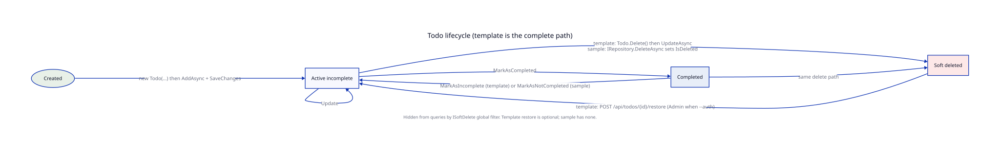

# 05. Lifecycles

Two real state machines exist: Todo and Identity/auth. Everything else is infrastructure (audit rows, blobs, messages).

## Todo

`Todo` is a single entity. There is no child collection and no EF ownership of related objects.

### States the code actually has

| State | How you can tell | Fields |
|---|---|---|
| Active incomplete | Default after ctor | `IsCompleted == false`, `IsDeleted == false` |
| Completed | After `MarkAsCompleted` | `IsCompleted == true` |
| Soft deleted | After delete | `IsDeleted == true` (template also sets `DeletedAt`) |

There is no `TodoStatus` enum. Completion and deletion are independent booleans. A completed todo can still be soft deleted.

Global query filter hides `IsDeleted == true`. Template restore: `POST /api/todos/{id}/restore` (`RestoreTodoCommand` → `Todo.Restore()`). Optional: omit the route if the app should not undelete. With `--auth` the route requires the `Admin` role. The sample still has no restore.

### Happy path (template, messaging on)

1. `POST /api/todos` → `CreateTodoCommand`.
2. Optional `ValidateAsync`.
3. `IMessageBus.InvokeAsync<Result<TodoResponse>>` or `TodoCommandHandler.Handle`.
4. `new Todo(title, description, priority, dueDate)`.
5. Template ctor: `ArgumentException` if title is blank. Sets `CreatedAt`/`LastModifiedAt` itself. Raises `TodoCreatedEvent` when `UseMessaging`.
6. `ITodoRepository.AddAsync` + `IUnitOfWork.SaveChangesAsync`.
7. Interceptors: audit stamp (also in `DbContextBase`), optional `AuditLog`, optional publish.
8. Cache key `todo_{id}` invalidated when `UseCaching`.
9. `MatchHttp` → `201 Created`.

Update: `UpdateTodoCommand` → `todo.Update(...)` → `UpdateAsync` + save.

Complete: `POST /api/todos/{id}/complete` → `CompleteTodoCommand` → `MarkAsCompleted` (returns immediately if already complete) → save.

Delete: `DeleteTodoCommand` → `todo.Delete()` → `UpdateAsync` (not `Repository.DeleteAsync`) → save. Soft delete is explicit on the entity.

Restore (template, optional): `POST /api/todos/{id}/restore` → `RestoreTodoCommand` → `GetByIdIncludingDeletedAsync` (`IgnoreQueryFilters`, still tenant-scoped when `--multitenant`) → `todo.Restore()` → save. With `--auth` this is Admin-only.

List/get (single project): `GetTodosQuery` / `GetTodoByIdQuery` use `TodoFilterSpecification`, `TodoPaginatedSpecification`, `TodoByIdSpecification`. Get by id uses `UseNoTracking` and, with `--caching`, a 5 minute `ICacheService` entry of the `TodoResponse` DTO (not the entity — Redis JSON cannot round-trip private setters).

List (multi project): `GET /api/todos` sends `GetAllTodosQuery`. `TodoCommandHandler.Handle` calls `ITodoRepository.GetAllAsync` (optional `ICacheService` key `todos_all` of `TodoResponse` DTOs). There is no filter or paging in the multi template.

### Happy path (sample)

1. `POST /api/todos` with `WithValidation<CreateTodoRequest>`.
2. `new Todo(...)`. Sample validates title (not empty, max 100) and priority 0..5 via `DomainException`.
3. `IRepository<Todo>.AddAsync` + `IUnitOfWork.SaveChangesAsync`.
4. `201` with `TodoResponse`.
5. Update can flip completion via `request.IsCompleted` then `Update(...)`. There is no `/complete` route.
6. Delete calls `repository.DeleteAsync(todo)`, which sets `IsDeleted` because `Todo` is `ISoftDelete`. Sample `Todo` does **not** raise `TodoDeletedEvent`.

Sample `TodoCreatedEvent` is raised, but `UseDomainEventPublishing` is not wired. The handler class is live Wolverine code that will not run from SaveChanges.

### Commands and methods

| Action | Template command | Sample entry | Domain method |
|---|---|---|---|
| Create | `CreateTodoCommand` | `CreateTodo` | ctor |
| Update | `UpdateTodoCommand` | `UpdateTodo` | `Update` |
| Complete | `CompleteTodoCommand` | `UpdateTodo` when `IsCompleted` | `MarkAsCompleted` |
| Incomplete | none | `UpdateTodo` when not completed | `MarkAsIncomplete` / `MarkAsNotCompleted` |
| Delete | `DeleteTodoCommand` | `DeleteTodo` | `Delete` (template) or repo soft delete (sample) |
| Restore | `RestoreTodoCommand` (template; Admin when `--auth`) | none | `Restore` |
| List | `GetTodosQuery` | `GetTodos` | none |
| Get | `GetTodoByIdQuery` | `GetTodoById` | none |

### Side effects on Todo save

| Side effect | When it runs |
|---|---|
| `CreatedAt` / `LastModifiedAt` via `ApplyAuditInfo` | Every save of `IAuditableEntity` |
| `AuditLog` row | Sample default on; template when `--audit` |
| Domain event publish | Template `--messaging` only |
| Cache remove `todo_{id}` | Template `--caching` on writes |
| Event handler log | After publish (template). Sample handlers exist but are not fed by SaveChanges. |

## Identity and auth

Identity is ASP.NET Identity, not a domain aggregate. Persistence is `UserManager` / `SignInManager`, not `IRepository`.

### Sample

| Step | Entry | What happens |
|---|---|---|
| Register | `POST /api/users/register` and Identity `/register` | `User` created, role `User` added on the custom route |
| Login | `POST /api/users/login` and Identity `/login` | `SignInManager` / Identity API |
| Profile | `GET/PUT /api/users/profile` | Authenticated |
| Admin | `/api/admin/users*` | Policy `Admin` |
| Seed | `RoleSeeder`, `UserSeeder` | Startup hosted service |

`User` has public setters. No `MarkAsRegistered`. No user domain events.

### Template (`--auth`)

| Step | Command | Handler | Domain / Identity call |
|---|---|---|---|
| Register | `RegisterUserCommand` | `RegisterUserHandler` | `new ApplicationUser`, optional `MarkAsRegistered`, `UserManager.CreateAsync` |
| Confirm email | `ConfirmEmailCommand` | `ConfirmEmailHandler` | `UserManager.ConfirmEmailAsync` |
| Login | `AuthLoginCommand` | `AuthLoginHandler` | cookie: `IAuthSessionService.ValidateCredentialsAsync` + `SignInAsync`. Tokens: `POST /connect/token` (password or authorization_code) |
| Refresh | none (OpenIddict grant) | `OpenIddictEndpoints` `/connect/token` | `grant_type=refresh_token`; `AllowRefreshTokenFlow` + reference refresh tokens |
| Logout | `AuthLogoutCommand` | `AuthLogoutHandler` | cookie sign-out. Tokens: `POST /connect/logout` revokes all OpenIddict tokens |
| Change password | `ChangePasswordCommand` | `ChangePasswordHandler` | `UserManager.ChangePasswordAsync` |
| Forgot password | `ForgotPasswordCommand` | `ForgotPasswordHandler` | generate token, send email |
| Reset password | `ResetPasswordCommand` | `ResetPasswordHandler` | `UserManager.ResetPasswordAsync` |
| External sign-in | `ExternalAuthSignInCommand` | `ExternalAuthSignInHandler` | create/link user, sign in |

Cookie login and OpenIddict tokens are **two sessions**. `POST /api/auth/login` / `/api/auth/logout` only touch the Identity cookie (SSR / `/connect/authorize`). Bearer clients use `/connect/token` and `/connect/logout`.

#### Login → refresh → logout (tokens)

OpenIddict is enabled with `AllowRefreshTokenFlow()`, `UseReferenceRefreshTokens()`, and `offline_access`. Seeded clients (`mca-web-client`, `mca-mobile-client`) have `GrantTypes.RefreshToken`. Lifetimes come from `OpenIddict:TokenLifetimes` (default access `01:00:00`, refresh `14.00:00:00`).

1. **Login (tokens).** `POST /connect/token`
   - Password grant: `grant_type=password`, username/password, `client_id` (and secret for the confidential web client), scopes including `offline_access` and `mca.api`. Scalar’s Development password flow does this (`Program.cs` `SelectedScopes` includes `offline_access`).
   - Authorization-code grant: cookie login first (`POST /api/auth/login`), then `/connect/authorize` (PKCE), then `grant_type=authorization_code` at `/connect/token`.
2. Response includes `access_token` and `refresh_token` (opaque **reference** tokens stored by OpenIddict, not JWTs you can decode locally).
3. Call APIs with `Authorization: Bearer {access_token}` until the access token expires.
4. **Refresh.** `POST /connect/token` with `grant_type=refresh_token`, the refresh token, and client credentials. `OpenIddictEndpoints` authenticates that token, reloads the user (`UserManager.FindByIdAsync`), and signs in a new principal with the previous scopes. If the user no longer exists → `invalid_grant`.
5. **Logout (tokens).** `POST /connect/logout` calls `ITokenService.RevokeAllTokensAsync` (every OpenIddict token for that subject) then `SignOut`. One token: `POST /connect/revoke`. Cookie logout (`POST /api/auth/logout`) does **not** revoke refresh tokens.

#### Browser PKCE (`--frontend` + `--auth`)

Generated `apps/web/src/lib/auth` (`createMcaAuth`) is the first-party SPA contract:

1. `login()` → `/connect/authorize` (authorization-code + PKCE, public client `mca-spa-client`).
2. `/callback` → `handleCallback()` exchanges the code at `/connect/token`.
3. `fetch(apiUrl)` attaches `Authorization: Bearer` and on 401 refreshes (`grant_type=refresh_token`).
4. Origins listed on the SPA client and in `Cors:AllowedOrigins`: `http://localhost:4321`, `http://localhost:3000`.

The sample has no this client.

The sample (`AddIdentityApiEndpoints`) has cookie/Identity-API login and logout only. It has **no** refresh-token grant.

Email confirmation after register:

- Messaging on: `UserRegisteredEvent` → `AuthEventHandler` generates token and calls `IEmailService.SendEmailConfirmationAsync`.
- Messaging off: `RegisterUserHandler` sends the email inline. Failure is logged, register still succeeds.

OpenIddict authorize, token (including refresh), userinfo, revoke, and end-session live on `/connect/*` and Development `/oauth/demo/*`, `/dev/openiddict/*`. That is framework hosting, not a domain aggregate — but refresh **is** part of the auth lifecycle above.

Seeded Development admin (`admin@example.com` / `Admin123!`) is controlled by `Seed:*` in generated `appsettings.Development.json`.

## Storage (optional template)

No entity lifecycle. `POST /api/storage/upload-url` and `GET /api/storage/download-url` call `IBlobStorage` and return signed URLs. Nothing in Domain tracks a blob.

## Next

[06. Events and side effects](06-events-and-side-effects.md)
