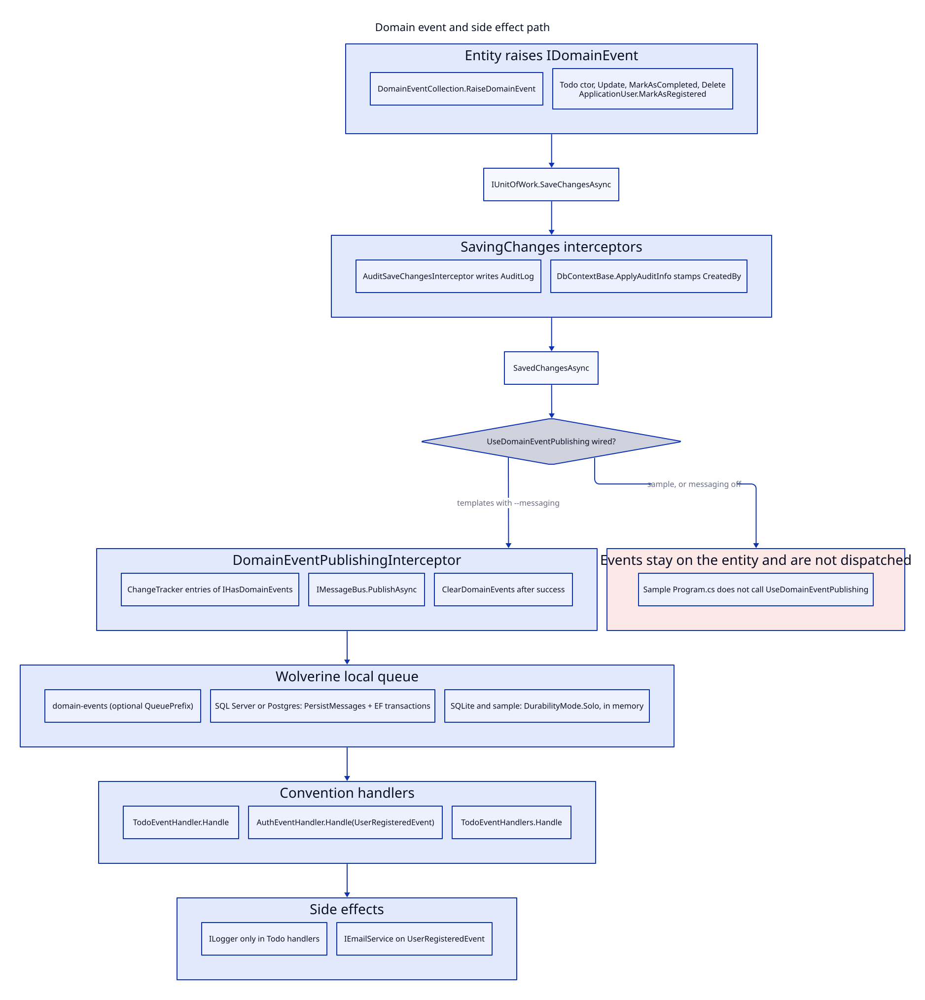

# 06. Events and side effects



There is no custom MCA outbox table. Durable delivery is Wolverine persistence. Audit is an EF insert in the same transaction, not an event.

## How an event is raised

Entities do not publish. They append to an in memory list.

```text
DomainEventCollection.RaiseDomainEvent
  or EntityWithEvents.RaiseDomainEvent (protected)
```

| Entity | How it implements `IHasDomainEvents` | When it raises |
|---|---|---|
| Sample `Todo` | `DomainEventCollection` field | ctor, `Update`, `MarkAsCompleted` (not delete, not incomplete) |
| Template `Todo` | same, compiled only with `UseMessaging` | ctor, `Update`, `MarkAsCompleted`, `Delete` |
| Template `ApplicationUser` | same, `UseMessaging` | `MarkAsRegistered()` from `RegisterUserHandler` |
| Sample `User` | does not implement | never |

Event types: `TodoCreatedEvent`, `TodoUpdatedEvent`, `TodoCompletedEvent`, `TodoDeletedEvent`, sample only `TodoReminderEvent`, `UserRegisteredEvent`. All are records extending `EntityDomainEvent<TKey>`.

`IDomainEventPublisher.ScheduleAsync` exists. No production caller schedules `TodoReminderEvent`. The sample handler is unused in the happy path.

## How an event is dispatched

### Automatic path (template `--messaging`)

1. `Program.cs` calls `options.UseDomainEventPublishing(sp)` on `AppDbContext`.
2. `AddDomainEventPublishing` registers scoped `DomainEventPublishingInterceptor` and `WolverineDomainEventPublisher`.
3. After a successful `SaveChangesAsync`, `SavedChangesAsync` collects `ChangeTracker.Entries<IHasDomainEvents>()` with a list that is not empty.
4. It `PublishAsync` each event on Wolverine concurrently (`Task.WhenAll`).
5. On success it calls `ClearDomainEvents()`. On failure it logs and rethrows. Events stay on the entity.

Sync `SaveChanges` is a different path: events are cleared immediately, then published on `Task.Run` without waiting. The interceptor logs a warning. Prefer `SaveChangesAsync`.

### Sample gap

`samples/MinimalCleanArch.Sample/Program.cs` calls `AddMinimalCleanArchMessaging` when `Features:Messaging` is true (default). That registers Wolverine and the interceptor type. It never calls `UseDomainEventPublishing`. `AddMinimalCleanArch<ApplicationDbContext>` only adds `UseAuditInterceptor`. Sample domain events are not published after save.

Grep for `UseDomainEventPublishing` to confirm: live call sites are template `Program.cs` files and a template integration test, not the sample.

### Manual path

`IDomainEventPublisher` can be injected and called directly. Generated handlers do not do this. They rely on the interceptor.

Commands and queries when messaging is on use `IMessageBus.InvokeAsync`. That is request/response mediation, not domain event publish.

## Where handlers live

Wolverine convention: public `Handle(T message, ...)` on a class. Discovery:

- `MessagingOptions.IncludeAssembly(...)` if set
- else the entry assembly

| Handler | Messages | Side effect |
|---|---|---|
| Sample `TodoEventHandlers` | all five Todo events | `ILogger` + `Task.Delay(10)` |
| Template `TodoEventHandler` | four Todo events | `ILogger` only |
| Template `AuthEventHandler` | `UserRegisteredEvent` | confirmation email via `IEmailService` |

Todo handlers do not send email, update projections, or write other aggregates.

## Outbox, queues, buses

| Mode | Entry method | Persistence | Durability | Use when |
|---|---|---|---|---|
| In-memory | `AddMinimalCleanArchMessaging` | none | `DurabilityMode.Solo` | Sample; SQLite templates |
| SQL Server outbox | `AddMinimalCleanArchMessagingWithSqlServer` | `PersistMessagesWithSqlServer(schema)` | `Balanced` | `--messaging` + `--db sqlserver` |
| Postgres outbox | `AddMinimalCleanArchMessagingWithPostgres` | `PersistMessagesWithPostgresql(schema)` | `Balanced` | `--messaging` + `--db postgres` |

Durable modes also call `UseEntityFrameworkCoreTransactions()` and `Policies.AutoApplyTransactions()`. Schema default is `wolverine` (`MessagingOptions.SchemaName`).

Local queue: `MessagingOptions.GetEffectiveLocalQueueName()` = `QueuePrefix` + `domain-events`. Parallelism defaults to `Environment.ProcessorCount`.

There is no Azure Service Bus, RabbitMQ, or Kafka wiring in this repo.

Aspire sample note (`samples/MinimalCleanArch.Aspire/README.md`): the sample keeps in memory Wolverine even when Postgres is running. Durable outbox against connection `mca` is not implemented.

## Execution context on messages

`MessagingExecutionContext` reads Wolverine envelope headers `mca-user-id`, `mca-user-name`, `mca-tenant-id`, plus envelope `TenantId` and `CorrelationId`, then falls back to HTTP. Registering messaging **replaces** `IExecutionContext` with this type.

## Audit (not an event)

`AuditSaveChangesInterceptor` runs on `SavingChanges`. It writes `AuditLog` into the same DbContext. Operations: `Create`, `Update`, `Delete`, `SoftDelete`, `Restore`.

Known limitation in `ProcessTemporaryPropertiesAsync`: the method is `await Task.CompletedTask`. Create rows whose primary key is still temporary at `SavingChanges` are skipped (`HasTemporaryProperties`). New `Todo` rows with int identity may miss an audit insert until that method is implemented. Entries without temporary keys are inserted before save.

## Other side effects on save

| Effect | Mechanism |
|---|---|
| CreatedBy / LastModifiedBy | `DbContextBase.ApplyAuditInfo` from `IExecutionContext.UserId` |
| Soft delete | `Repository.DeleteAsync` sets `IsDeleted` |
| Encryption | EF converter when `UseEncryption` was called |
| Identity emails | handlers, not interceptors |

## Next

Context pages under [contexts/](contexts/todo.md).
