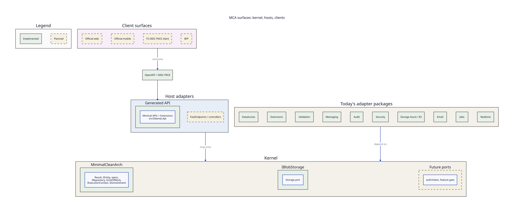

# 07. Bootstrap product

MinimalCleanArch is a Clean Architecture **kernel** plus host adapters and optional client surfaces. It is not “Minimal APIs on .NET.” ASP.NET Core Minimal APIs are the **first host adapter**.

This page is the product identity for the bootstrapper. Today’s packages, sample, and `dotnet new mca` output still exist; they sit in these layers instead of defining the product.

The tables below are the product backlog as of this writing. **Stubs are planned, not implemented.** Sample vs template differences stay a table, not a smear.

## Three layers

```text
                    +---------------------------+
                    |  Client surfaces          |
                    |  web  |  mobile  |  BFF   |
                    +-------------+-------------+
                                  | OpenAPI + OIDC PKCE
                    +-------------v-------------+
                    |  Host adapters            |
                    |  ASP.NET Minimal APIs     |
                    |  (later: FastEndpoints,   |
                    |   controllers, others)    |
                    +-------------+-------------+
                                  |
                    +-------------v-------------+
                    |  Kernel                   |
                    |  Result, entities, specs, |
                    |  IRepository, IUnitOfWork,|
                    |  IExecutionContext,       |
                    |  events, IBlobStorage     |
                    +---------------------------+
```



Solid green is implemented. Dashed gold is still planned (BFF host, extra kernel ports). Official Astro and TanStack Start web, Expo mobile, TypeScript OIDC PKCE, `--controllers`, and `--fastendpoints` are implemented. Today’s packages remain (core in the kernel box; DataAccess, Extensions, Validation, Messaging, Audit, Security, Storage, Email, Jobs, Realtime adapters in the package row).

Anything a second host or a TypeScript / Expo client cannot consume does not belong in the kernel.

## Kernel

Kernel code is framework-neutral. Public contracts must stay free of ASP.NET types, EF Core types, Wolverine, and OpenIddict.

| May live in kernel | Package / type today |
|---|---|
| `Result` / `Error` | `MinimalCleanArch` |
| `IEntity`, specifications, `IRepository`, `IUnitOfWork` | `MinimalCleanArch` |
| `IExecutionContext` (UserId, TenantId, CorrelationId) | `MinimalCleanArch` — cross-host scope |
| `IDomainEvent` | `MinimalCleanArch` |
| `IBlobStorage` | `MinimalCleanArch.Storage` (abstraction; Azure adapter is not kernel) |
| `IEmailSender` | `MinimalCleanArch.Email` (SMTP + HTTP API adapters) |
| `IJobScheduler` | `MinimalCleanArch.Jobs` (hosted-service fallback; Wolverine adapter in Messaging) |
| `IRealtimePublisher` | `MinimalCleanArch.Realtime` (SignalR adapter in Extensions) |
| `IFeatureGate` | `MinimalCleanArch.Features` (config + optional store; HTTP `RequireFeature` in Extensions) |
| `ITenantEntity` | `MinimalCleanArch` — row ownership; EF named filters on net10, combined + re-apply on net9 |
| Future ports (auth/token) | not shipped as kernel ports yet |

`IDomainEventPublisher` exists; the Wolverine implementation is an **adapter**, not kernel.

EF persistence (`MinimalCleanArch.DataAccess`), audit interceptors, column encryption implementations, and Wolverine wiring are infrastructure adapters around the kernel, not the kernel itself.

## Host adapters

A host adapter maps HTTP (or another process model) onto kernel ports: execution context, `Result` → response, validation, auth session.

| Adapter | Where | Status |
|---|---|---|
| ASP.NET Core Minimal APIs | `MinimalCleanArch.Extensions` + generated `{Name}.Api` (`src/{Name}.Api` in multi-project apps) | implemented; adapter one |
| ASP.NET controllers | template `--controllers` (`TodoController` + same handlers; does not call `MapTodoEndpoints`) | implemented |
| FastEndpoints | template `--fastendpoints` (`TodoFastEndpoints` + same handlers) | implemented |
| Non-.NET backend | not a second kernel | consume OpenAPI + OIDC (Scalar `/scalar/v1` in Development) |

Must stay in a host adapter (or the generated host project), not in kernel:

- Minimal API endpoint helpers, `IResult`, ASP.NET middleware
- OpenIddict / ASP.NET Identity types
- Wolverine host setup
- Scalar / OpenAPI document generation
- Cookie and bearer scheme registration

`MinimalCleanArch.Validation` is composition-root / host glue (FluentValidation registration), not kernel.

The **supported teaching path** is:

```bash
dotnet new mca -n MyApp --recommended --auth
dotnet run --project src/MyApp.Api
```

The in-repo sample (`samples/MinimalCleanArch.Sample`) is a **package smoke host**. Do not copy its `TodoEndpoints` writing the aggregate when starting a real app. Generated apps use handlers (`TodoCommandHandler`). Other template flags remain valid; they are not the teaching default.

## Client contract

Official clients (future web, mobile, BFF, non-.NET) talk to a generated host through:

1. **OpenAPI** (Scalar at `/scalar/v1` in Development on the generated API)
2. **OIDC authorization-code + PKCE** when the template is generated with `--auth` (OpenIddict)

They must not take a dependency on `MinimalCleanArch.Extensions` or any ASP.NET type. Kernel types are not a TypeScript SDK; the HTTP + OIDC contract is.

| Surface | Status |
|---|---|
| Generated HTTP API (`dotnet new mca`) | implemented |
| Official web (Astro) | implemented (`--frontend`; pages + OIDC PKCE) |
| Second web (TanStack Start) | implemented (`--frontend --webFramework tanstack`) |
| Official mobile (Expo) | implemented (`--mobile`; bearer + secure store) |
| TypeScript OIDC PKCE client | implemented (`apps/web/src/lib/auth`; public `mca-spa-client` with `--auth`) |

Until those surfaces exist, the generated API is the only official client-facing host. Adding a frontend later must not fork the kernel.

## Generated shape (multi-project, today)

Filesystem `src/` is required for generated multi-project apps:

```text
{Name}/
  src/{Name}.Api/              # first host adapter
  src/{Name}.Domain/
  src/{Name}.Application/
  src/{Name}.Infrastructure/
  {Name}.AppHost/              # optional --aspire
  tests/                       # optional --tests
```

`--frontend` adds `apps/web` and `--mobile` adds `apps/mobile`. They consume OpenAPI + OIDC; they are not a second kernel.

## Capability matrix

Status is `implemented`, `planned`, or `out of scope`. Baseline is TrustedPostman, aliif, both, or —. Stubs are **planned**.

| ID | Capability | Status | Where | Baseline |
|---|---|---|---|---|
| K1 | Domain primitives, Result, specs, repos | implemented | package `MinimalCleanArch` | both |
| K2 | EF persistence, soft delete, audit stamps | implemented | package `MinimalCleanArch.DataAccess` | both |
| K3 | HTTP bootstrap: ProblemDetails, headers, rate limit, health, OTel, Serilog | implemented | package `MinimalCleanArch.Extensions`; template `--recommended` | both |
| K4 | Validation | implemented | package `MinimalCleanArch.Validation`; template `--validation` / `--recommended` | both |
| K5 | Messaging + outbox (SQL Server/Postgres) | implemented | package `MinimalCleanArch.Messaging`; template `--messaging` (sample: in-memory only) | TrustedPostman |
| K6 | Audit log interceptor | implemented | package `MinimalCleanArch.Audit`; template `--audit` | both |
| K7 | Column encryption | implemented | package `MinimalCleanArch.Security`; template `--security` | — |
| K8 | Blob storage + signed upload | implemented | package `MinimalCleanArch.Storage`; template `--storage` | TrustedPostman |
| K9 | Caching | implemented | template `--caching` / `--recommended` register `ICacheService` (memory or Redis) and Todo reads go through `GetOrCreateAsync` | both |
| K10 | API versioning in **template** | implemented | template `--recommended` / `--versioning` / `--all` call `AddMinimalCleanArchApiVersioning` (same as the sample) | — |
| A1 | Register / confirm / forgot / reset / change password | implemented | template `--auth` | both |
| A2 | Login / logout / cookie + bearer | implemented | template `--auth` | both |
| A3 | Refresh tokens | implemented | OpenIddict `AllowRefreshTokenFlow` (`--auth`). Lifecycle: [05. Lifecycles](05-lifecycles.md) next to login/logout. Sample has no refresh grant | both |
| A4 | OpenIddict OIDC + PKCE | implemented | template `--auth` | both |
| A5 | External providers | implemented | `--auth`: Google/Microsoft/GitHub when `Authentication:*` ClientId+Secret are set | both |
| A6 | Roles (Admin/User/Manager) | implemented | template `--auth` seed constants | both |
| A7 | Org membership + invitations | implemented | `--auth --multitenant`: `/api/organizations` create/invite-by-code/join; roles stored as `OrganizationRole` rows | TrustedPostman |
| A8 | Multi-tenant isolation (filter/RLS) | implemented | template `--multitenant`: `ITenantEntity` + EF query filter (default). Claim `tenant_id`. Postgres RLS is not the default | TrustedPostman |
| A9 | Email package | implemented | package `MinimalCleanArch.Email`; template `--auth` uses `AddEmail` | both |
| H1 | Background jobs | implemented | package `MinimalCleanArch.Jobs` (`IJobScheduler`); `--jobs` / `--messaging` / `--all` purge soft-deleted Todos. Wolverine adapter `AddWolverineJobs` | TrustedPostman |
| H2 | Realtime | implemented | package `MinimalCleanArch.Realtime` (`IRealtimePublisher`); SignalR adapter in Extensions; `--realtime` / `--all` hub `/hubs/realtime`; Todo writes publish channel `todos` | TrustedPostman |
| H3 | Feature flags / entitlements | implemented | package `MinimalCleanArch.Features` (`IFeatureGate`); `--features` / `--all` gates `GET /api/todos/export` via `Features:Flags:todo-export` | TrustedPostman |
| H4 | Soft-delete restore | implemented | template `POST /api/todos/{id}/restore` (`Todo.Restore()`). Optional; `--auth` requires Admin. Sample has no restore | — |
| C1 | Official web scaffold | implemented | `--frontend` Astro (`apps/web`): login, signup, confirm-email, forgot/reset, todos, logout | both |
| C2 | Second web framework | implemented | `--frontend --webFramework tanstack` TanStack Start, same `src/lib/auth` contract | both |
| C3 | Official mobile scaffold | implemented | `--mobile` Expo: password grant + `expo-secure-store` + Todo list | TrustedPostman |
| C4 | TS OIDC client | implemented | `--frontend` `apps/web/src/lib/auth` (`oidc-client-ts` PKCE + refresh + Bearer fetch). `--auth` seeds public `mca-spa-client` at localhost:4321 / :3000 | both |
| C5 | i18n / RTL | implemented | Astro header toggle `en` / `ar` (`dir=rtl`) in `apps/web/src/lib/i18n.ts` | aliif |
| C6 | BFF vs direct-API guidance | implemented | this page, Client patterns | both |
| C7 | Web E2E | implemented | Playwright smoke for Astro (`:4321`) and TanStack Start (`:3000`): `apps/web/e2e/smoke.spec.ts`. `API_URL` + `WEB_URL` + `npm run test:e2e` | TrustedPostman |
| O1 | Docker / compose / Aspire / kind | implemented | template `--docker`, `--aspire`, `--all` | both |
| O2 | Template unit/integration/smoke | implemented | `tests/MinimalCleanArch.Templates.Tests`; `scripts/validate-templates.ps1` | both |
| O3 | CI documented | implemented | this section; `.github/workflows/{nuget,publish-nuget,validate-templates}.yml` | both |
| X1 | Kernel vs host vs client docs | implemented | this page; [surfaces diagram](diagrams/surfaces.svg); [01. System overview](01-system-overview.md) | this goal |
| X2 | Second ASP.NET host adapter | implemented | `--controllers` maps `TodoController`; `--fastendpoints` maps FastEndpoints; Minimal API Todo endpoints are not mapped | this goal |

## Client patterns: BFF vs direct API vs mobile

| Surface | Auth | API calls | When to use |
|---|---|---|---|
| Astro / TanStack Start (`--frontend`) | Browser PKCE (`mca-spa-client`). Tokens in `sessionStorage`. | `Authorization: Bearer` via `McaAuthClient.fetch` | First-party web. CORS origins `http://localhost:4321` and `:3000`. |
| BFF (not generated) | Auth cookies on a backend-for-frontend; browser never holds tokens | Server-side HTTP to the API | If you cannot store tokens in the browser (TrustedPostman web). Put the BFF origin on OpenIddict, not the SPA client. |
| Expo (`--mobile`) | Resource-owner password against `/connect/token` (`mca-web-client`) in this scaffold; production apps should prefer PKCE + secure store | Bearer | Native. Do not use the public SPA client with a secret. |

OpenAPI is the non-.NET contract: Development hosts Scalar at `/scalar/v1` (`AddOpenApi` + `MapOpenApi` in the generated host, including `--recommended`).

Out of scope (not MCA kernel):

| Capability | Status | Where | Baseline |
|---|---|---|---|
| TrustedPostman delivery/custody/forensics domain | out of scope | do not copy | TrustedPostman |
| aliif outreach/submissions domain | out of scope | do not copy | aliif |
| Maps, PostGIS, geofencing | out of scope | — | — |
| Store listing / EAS production release of a driver app | out of scope | — | TrustedPostman |
| A second kernel in another backend language | out of scope | OpenAPI + OIDC only | this goal |

## Sample vs template

Both are “an MCA app”. They are not the same design. Copying the sample’s endpoint-writes-the-aggregate path is not the way to start a generated product.

| Concern | Sample (`samples/MinimalCleanArch.Sample`) | Generated template (`dotnet new mca`) |
|---|---|---|
| Role | Package smoke demo | Supported teaching path: `--recommended --auth` |
| Project shape | One project (`API/`, `Domain/`, `Infrastructure/`) | Multi-project under `src/{Name}.*`, or `--single-project` |
| Todo write path | `TodoEndpoints` uses `IRepository<Todo>` directly | `TodoCommandHandler` via handler or `IMessageBus` |
| User model | `User : IdentityUser` in Domain | `ApplicationUser` in `Application/Identity` |
| Auth stack | `AddIdentityApiEndpoints<User>` plus `/api/users` | Optional `--auth`: Identity + OpenIddict + `/api/auth` |
| Domain event interceptor | Registered in DI, **not** added to DbContext | `UseDomainEventPublishing` when `--messaging` |
| Durable outbox | Not used (in-memory even under Aspire) | SQL Server/Postgres when `--messaging` and `--db` is not sqlite |
| API versioning | `AddMinimalCleanArchApiVersioning()` | `--recommended` / `--versioning` / `--all` call `AddMinimalCleanArchApiVersioning()` |

## CI: validate and publish

Workflows live under `.github/workflows/`. Local equivalents are `scripts/pack.sh` / `scripts/pack.ps1` and `scripts/validate-templates.sh` (implementation: `templates/scripts/validate-templates.ps1`).

| Workflow | File | When | What |
|---|---|---|---|
| Build, test, pack | `nuget.yml` | PR and push to `dev` / `main` / `master`; `v*` tags; `workflow_dispatch` | Restore `MinimalCleanArch.slnx` + templates; build/test `MinimalCleanArch.CI.slnx`; calls `validate-templates.yml`; pack job writes `artifacts/packages` |
| Validate templates | `validate-templates.yml` | Called from `nuget.yml`; also `workflow_dispatch` | Windows job: `scripts/pack.ps1` then `templates/scripts/validate-templates.ps1` against that local feed (`-McaVersion` from `src/Directory.Build.props`) |
| Publish (Trusted Publishing) | `publish-nuget.yml` | `v*` tags; `workflow_dispatch` with a version | Pack, NuGet OIDC login (`id-token`), `dotnet nuget push` to nuget.org, GitHub Release on tag |

`nuget.yml` also has a `publish` job on `v*` tags or `workflow_dispatch` with `publish=true`. It uses `secrets.NUGET_API_KEY` and environment `nuget-publishing`. Prefer `publish-nuget.yml` for nuget.org Trusted Publishing (OIDC, no long-lived key in the job).

A contributor checking a PR: look at `nuget.yml` → `build-and-test` then `validate-templates`. A contributor shipping a version: tag `v*` (or dispatch `publish-nuget.yml` with the version). Local smoke: `./scripts/pack.sh` then `./scripts/validate-templates.sh -McaVersion <version>`.

## How to read the rest of `docs/`

- Surfaces diagram (this page) — generated API, planned web/mobile/BFF, kernel, today’s packages
- [01. System overview](01-system-overview.md) — packages, sample, generated hosts as they exist
- [02. Architecture](02-architecture.md) — request and save path on **adapter one**
- Context pages — capability modules (`Extensions` = HTTP host adapter, core = kernel primitives)
- Package READMEs — consumer usage of each NuGet
