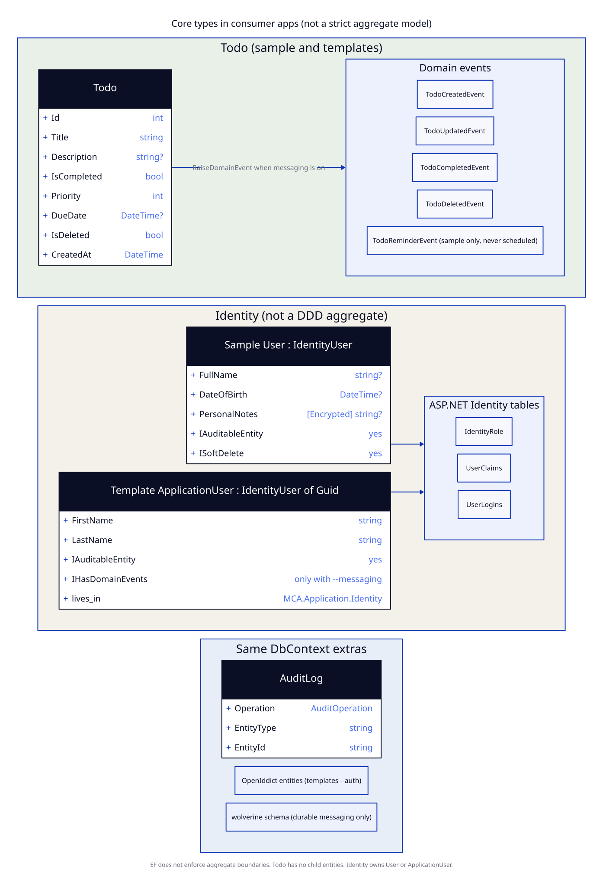

# Context: Todo

**Boundary:** consumer Domain + Application + `/api/todos`. Same module in the sample and in generated apps.  
**Kind:** Closest thing to a business bounded context.  
**Database:** `Todos` table in the **shared** app database.  
**UI:** HTTP + Scalar only.

## Aggregates

`Todo` is the only entity. It has no children. EF maps it as a single table. Treat it as a single entity aggregate because the code puts invariants on the class, not because EF enforces a boundary.

| Surface | Sample | Template |
|---|---|---|
| Entity | `samples/MinimalCleanArch.Sample/Domain/Entities/Todo.cs` | `templates/mca/single/Domain/Entities/Todo.cs` |
| Events | `Domain/Events/TodoEvents.cs` | `Domain/Events/TodoEvents.cs` (gated) |
| Specs | `Infrastructure/Specifications/TodoSpecifications.cs` | `Application/Specifications/TodoSpecifications.cs` |
| Repo | generic `IRepository<Todo>` | `ITodoRepository` : `IRepository<Todo,int>` |
| Commands | none (endpoint-local) | `Application/Commands/TodoCommands.cs` (single and multi differ; see below) |
| Handler | none | `Application/Handlers/TodoCommandHandler.cs` |
| Event handler | `Application/Handlers/TodoEventHandlers.cs` | `Application/Handlers/TodoEventHandler.cs` |
| Endpoints | `API/Endpoints/TodoEndpoints.cs` | `Endpoints/TodoEndpoints.cs` |
| Validators | `API/Validators/TodoValidators.cs` | `Application/Validation/TodoValidators.cs` |
| Mapping | `TodoConfiguration` in `ApplicationDbContext.cs` | `AppDbContext.OnModelCreating` |

## Invariants the entity actually enforces

| Rule | Sample | Template |
|---|---|---|
| Title required | `DomainException` `TODO_TITLE_REQUIRED` | `ArgumentException.ThrowIfNullOrWhiteSpace` |
| Title max length | 100, `TODO_TITLE_TOO_LONG` | none on the entity (EF max 200) |
| Priority range | 0..5, `TODO_PRIORITY_OUT_OF_RANGE` | none |
| Description | stored; `[Encrypted]` | optional string; not encrypted in DbContext |
| Complete twice | raises another `TodoCompletedEvent` | returns immediately |

Template `Todo` writes `CreatedAt`/`LastModifiedAt` in methods. `DbContextBase.ApplyAuditInfo` will overwrite those on save.

## Commands and queries (template)

Single project (`templates/mca/single`):

| Type | Handler method | HTTP |
|---|---|---|
| `GetTodosQuery` | `Handle` → `TodoListResult` (items, total, page) | `GET /api/todos` |
| `GetTodoByIdQuery` | `Handle` → `TodoResponse` | `GET /api/todos/{id}` |
| `CreateTodoCommand` | `Handle` → `TodoResponse` | `POST /api/todos` |
| `UpdateTodoCommand` | `Handle` → `TodoResponse` | `PUT /api/todos/{id}` |
| `CompleteTodoCommand` | `Handle` → `Result` | `POST /api/todos/{id}/complete` |
| `DeleteTodoCommand` | `Handle` → `Result` | `DELETE /api/todos/{id}` |

`GetAllTodosQuery` is declared in the single project command file and has no handler.

Multi project (`templates/mca/multi`): `GET /api/todos` uses `GetAllTodosQuery` and returns all items. There is no `GetTodosQuery`, no specification folder, and no paging. Multi `TodoListResult` is only `Items`. Multi `TodoResponse` also includes `CreatedAt` and `LastModifiedAt`.

Sample routes omit `/complete`. Completion is a field on `UpdateTodoRequest`.

## Hosts

Same process as Identity. No dedicated Todo service.

## Integration

| Other context | Relationship |
|---|---|
| Persistence | Same `DbContext`. Soft delete filter. |
| Identity | Sample `GET /api/users/todos` filters `CreatedBy == userId`. No FK from `Todo` to `User`. |
| Messaging | Events published only if interceptor is on the context. |
| Audit | `AuditLog` rows for Todo changes when enabled. |
| Security | Sample encrypts `Description`. |

## Honesty

- Shared DB with Identity and audit.
- Generic repository (sample) or a thin typed wrapper (template).
- No value objects.
- Sample use cases sit in the endpoint class (fat endpoint, thin/no application layer).
- `ITodoRepository.GetByPriorityAsync` is dead API surface.
